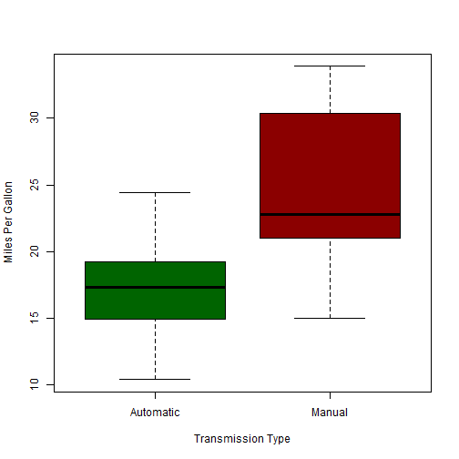
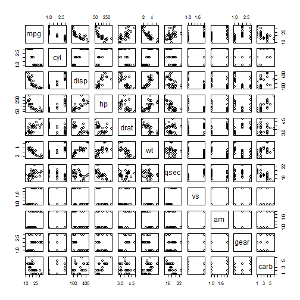
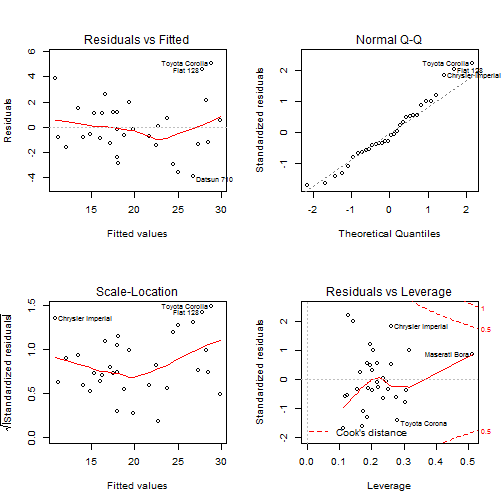

*Created with knitr*

#### Executive Summary
In this report, we analyzed the mtcars data set and establish the relationship between transmission type (manual or automatic) and miles per gallon (MPG) to find which transmission is better for MGP. We used mtcars dataset for this analysis. A t-test between automatic and manual transmission vehicles shows that manual transmission vehicles have a 7.245 greater MPG than automatic transmission vehicles. After fitting multiple linear regressions, analysis showed that the manual transmission contributed less significantly to MPG, only an improvement of 1.81 MPG. Other variables, weight, horsepower, and number of cylinders contributed more significantly to the overall MPG of vehicles.

#### Load Data and Perform Exploratory Analysis

```r
library(ggplot2) 
data(mtcars)
head(mtcars)
# Transform certain variables into factors
mtcars$cyl  <- factor(mtcars$cyl)
mtcars$vs   <- factor(mtcars$vs)
mtcars$gear <- factor(mtcars$gear)
mtcars$carb <- factor(mtcars$carb)
mtcars$am   <- factor(mtcars$am,labels=c("Automatic","Manual"))
```

Exploratory plots **(Appendix - Plot 1)** , We’ve visually verified that there is a significant increase in MPG when for vehicles with a manual transmission vs automatic. Now we will quantify this difference.


```r
aggregate(mpg~am, data = mtcars, mean)
```

```
##          am      mpg
## 1 Automatic 17.14737
## 2    Manual 24.39231
```

Thus we hypothesize that automatic cars have an MPG 7.25 lower than manual cars. We use t-test to determine if this is a significant difference


```r
tt_automatic <- mtcars[mtcars$am == "Automatic",]
tt_manual <- mtcars[mtcars$am == "Manual",]
t.test(tt_automatic$mpg, tt_manual$mpg)
```

```
## 
## 	Welch Two Sample t-test
## 
## data:  tt_automatic$mpg and tt_manual$mpg
## t = -3.7671, df = 18.332, p-value = 0.001374
## alternative hypothesis: true difference in means is not equal to 0
## 95 percent confidence interval:
##  -11.280194  -3.209684
## sample estimates:
## mean of x mean of y 
##  17.14737  24.39231
```

The p-value is 0.001374, The T-Test rejects the null hypothesis and thus we can state this is a significant difference.


```r
BaseModel <- lm(mpg ~ am, data = mtcars)
summary(BaseModel)
```

```
## 
## Call:
## lm(formula = mpg ~ am, data = mtcars)
## 
## Residuals:
##     Min      1Q  Median      3Q     Max 
## -9.3923 -3.0923 -0.2974  3.2439  9.5077 
## 
## Coefficients:
##             Estimate Std. Error t value Pr(>|t|)    
## (Intercept)   17.147      1.125  15.247 1.13e-15 ***
## amManual       7.245      1.764   4.106 0.000285 ***
## ---
## Signif. codes:  0 '***' 0.001 '**' 0.01 '*' 0.05 '.' 0.1 ' ' 1
## 
## Residual standard error: 4.902 on 30 degrees of freedom
## Multiple R-squared:  0.3598,	Adjusted R-squared:  0.3385 
## F-statistic: 16.86 on 1 and 30 DF,  p-value: 0.000285
```

This shows that the average MPG for automatic is 17.1 MPG, while manual is 7.2 MPG higher. The R2 value is 0.36 thus telling us this model only explains us 36% of the variance. As a result, we need to build a multivariate linear regression.

Using pairs plot **(Appendix - Plot 2)** We can conclude that cyl, disp, hp, wt have the strongest correlation with mpg. Thus, We build advance model based on our finding and then compare them to base model with anova function.


```r
AdvModel <- lm(mpg~am + cyl + disp + hp + wt, data = mtcars)
anova(BaseModel, AdvModel)
```

```
## Analysis of Variance Table
## 
## Model 1: mpg ~ am
## Model 2: mpg ~ am + cyl + disp + hp + wt
##   Res.Df    RSS Df Sum of Sq      F    Pr(>F)    
## 1     30 720.90                                  
## 2     25 150.41  5    570.49 18.965 8.637e-08 ***
## ---
## Signif. codes:  0 '***' 0.001 '**' 0.01 '*' 0.05 '.' 0.1 ' ' 1
```
This results in a p-value of 8.637e-08, and we can conclude that the Adbance model are significantly better. 

Residuals plot **(Appendix - Plot 3)** used to check for non-normality and can see they are all normally distributed.

The plots conclude:

* The randomness of the Residuals vs. Fitted plot supports the assumption of independence
* The points of the Normal Q-Q plot following closely to the line conclude that the distribution of residuals is normal
* The Scale-Location plot random distribution confirms the constant variance assumption
* Since all points are within the 0.05 lines, the Residuals vs. Leverage concludes that there are no outliers


```r
summary(AdvModel)
```

```
## 
## Call:
## lm(formula = mpg ~ am + cyl + disp + hp + wt, data = mtcars)
## 
## Residuals:
##     Min      1Q  Median      3Q     Max 
## -3.9374 -1.3347 -0.3903  1.1910  5.0757 
## 
## Coefficients:
##              Estimate Std. Error t value Pr(>|t|)    
## (Intercept) 33.864276   2.695416  12.564 2.67e-12 ***
## amManual     1.806099   1.421079   1.271   0.2155    
## cyl6        -3.136067   1.469090  -2.135   0.0428 *  
## cyl8        -2.717781   2.898149  -0.938   0.3573    
## disp         0.004088   0.012767   0.320   0.7515    
## hp          -0.032480   0.013983  -2.323   0.0286 *  
## wt          -2.738695   1.175978  -2.329   0.0282 *  
## ---
## Signif. codes:  0 '***' 0.001 '**' 0.01 '*' 0.05 '.' 0.1 ' ' 1
## 
## Residual standard error: 2.453 on 25 degrees of freedom
## Multiple R-squared:  0.8664,	Adjusted R-squared:  0.8344 
## F-statistic: 27.03 on 6 and 25 DF,  p-value: 8.861e-10
```

#### Conclusion:
The model explains 86.64% of the variance and as a result, cyl, disp, hp, wt did affect the correlation between mpg and am. Thus, we can say the difference between automatic and manual transmissions is 1.81 MPG.

#### Appendix

**Plot 1** - Boxplot of MPG vs transmission type


```r
boxplot(mpg ~ am, data = mtcars, col = (c("dark green","dark red")), ylab = "Miles Per Gallon", xlab = "Transmission Type")
```



**Plot 2** - Pairs plot for the data set


```r
pairs(mpg ~ ., data = mtcars)
```



**Plot 3** - Check residuals


```r
par(mfrow = c(2,2))
plot(AdvModel)
```


